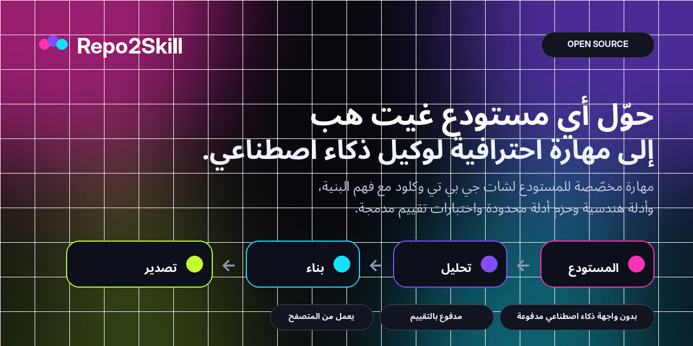
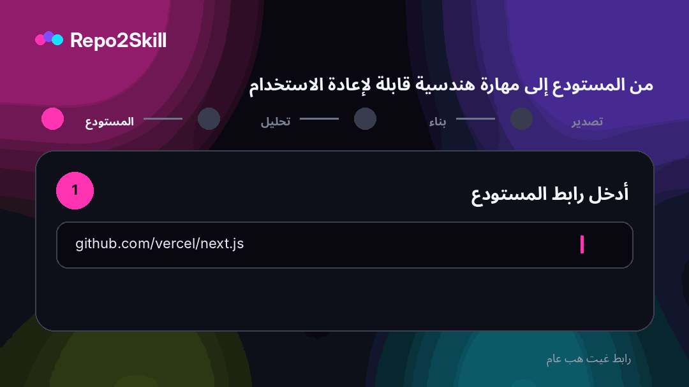

<div align="center">



<br />

**حوّل أي مستودع GitHub عام إلى Agent Skills احترافية ومخصّصة لقاعدة الشفرة لكل من ChatGPT وClaude، من دون أي API ذكاء اصطناعي مدفوع.**

<br />

[](https://repo2skill.vercel.app)
[](LICENSE)
[](https://repo2skill.vercel.app)

[English](README.md) · [فارسی](README.fa.md) · **العربية** · [中文](README.zh.md) · [Français](README.fr.md) · [Español](README.es.md) · [Italiano](README.it.md)

</div>

## شاهد المنتج

<div align="center">
  
</div>

## لماذا Repo2Skill؟

- **خاص بالمستودع** — مبني على الشفرة الحقيقية وملفات manifests والاختبارات وCI والمسارات والـ exports والإعدادات.
- **أوضاع هندسية** — Implement وDebug وReview وTest وExplain وRefactor وMigrate.
- **Progressive disclosure** — حزم أدلة صغيرة ومركّزة بدل تجميع ضخم للشفرة.
- **Evals مدمجة** — اختبارات مهام، استعلامات تفعيل إيجابية/سلبية، rubric وشروط hard-fail.
- **انضباط الأدلة** — فصل الحقائق الملحوظة عن الاستنتاجات والافتراضات.
- **صدق التحقق** — لا يمكن اعتبار فحص غير منفّذ ناجحاً.
- **وعي أمني** — نص المستودع دليل غير موثوق وليس تعليمات أعلى أولوية.
- **من دون API ذكاء اصطناعي مدفوع** — التحليل وإنشاء ZIP يتمان من المتصفح.

## كيف يعمل؟

يحلّل Repo2Skill بيانات المستودع وبنية الملفات والملفات عالية الإشارة وmanifests والاختبارات وCI والواجهات والأوامر الحقيقية، ثم يبني طبقة orchestration مدمجة مع مراجع مركّزة وEvals.

```text
GitHub repository
       ↓
Repository intelligence
       ↓
Architecture + interfaces + commands + tests + CI
       ↓
Bounded evidence packs
       ↓
Engineering playbooks + decision policy + evals
       ↓
ChatGPT Skill.zip  +  Claude Skill.zip
```

## مخرجات Skill احترافية

```text
my-repo-repository-engineer/
├── SKILL.md
├── references/
│   ├── repository-profile.md
│   ├── architecture.md
│   ├── workflows.md
│   ├── commands.md
│   ├── code-map.md
│   ├── interfaces.md
│   ├── dependencies.md
│   ├── testing-and-ci.md
│   ├── config-security.md
│   ├── decision-policy.md
│   ├── implementation-playbook.md
│   ├── debugging-playbook.md
│   ├── review-playbook.md
│   ├── refactor-migration-playbook.md
│   ├── evidence-index.md
│   ├── evidence-*.md
│   ├── file-index.md
│   └── provenance.md
└── evals/
    ├── evals.json
    ├── trigger-queries.json
    ├── rubric.md
    └── README.md
```

## جودة Skill والتقييمات

تتضمن المهارات اختبارات مهام، واستعلامات تفعيل إيجابية وسلبية، وrubric للتقييم، وشروط hard-fail للأوامر المختلقة وادعاءات التحقق الكاذبة والتعامل غير الآمن مع الأسرار والعمليات المدمّرة والترحيلات الكاسرة.

## بنية تعتمد على المتصفح

يتم جلب بيانات GitHub العامة والملفات الخام المختارة من المتصفح، كما يتم التحليل وإنشاء ZIP على جهة العميل. لا حاجة إلى OpenAI API أو Anthropic API أو vector database أو embedding أو خدمة تحليل مدفوعة.

## لغات الواجهة

English is the default UI language. Repo2Skill also includes فارسی, العربية, 中文, Français, Español and Italiano. Persian and Arabic layouts are RTL in the web app.

## التشغيل محلياً

```bash
npm install
npm run dev
```

```text
http://localhost:3000
```

Full verification:

```bash
npm run check
```

## النشر على Vercel

Import the repository as a Next.js project in Vercel. No environment variable is required.

Optional:

```bash
NEXT_PUBLIC_SITE_URL=https://your-domain.example
```

## نموذج الأمان

يُعامل محتوى المستودع كدليل غير موثوق. تفصل المهارة بين الحقائق الملحوظة والاستنتاجات، ولا تجمع قيم الأسرار، وتتطلب تحققاً صريحاً قبل عمليات release/deploy/reset/migration المدمّرة.

## النطاق الحالي

يركز Repo2Skill حالياً على مستودعات GitHub العامة. دعم OAuth/token للمستودعات الخاصة خارج نطاق النسخة المجانية عديمة الأسرار حالياً.

## المساهمة

See [CONTRIBUTING.md](CONTRIBUTING.md).

## الترخيص

[MIT](LICENSE)
