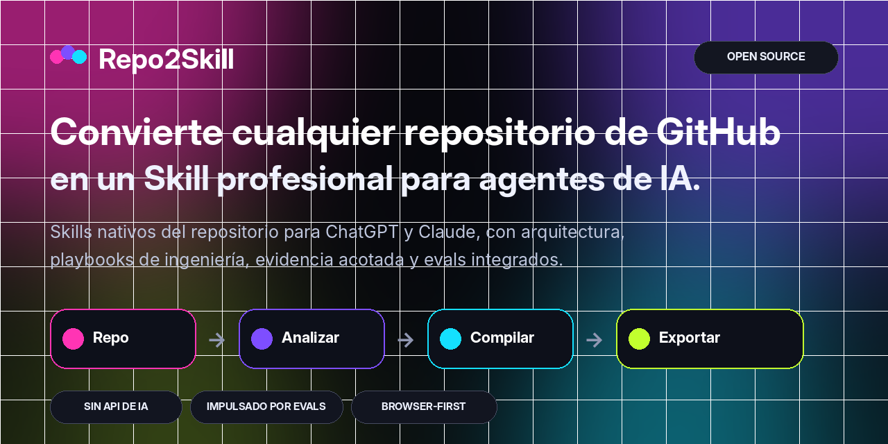
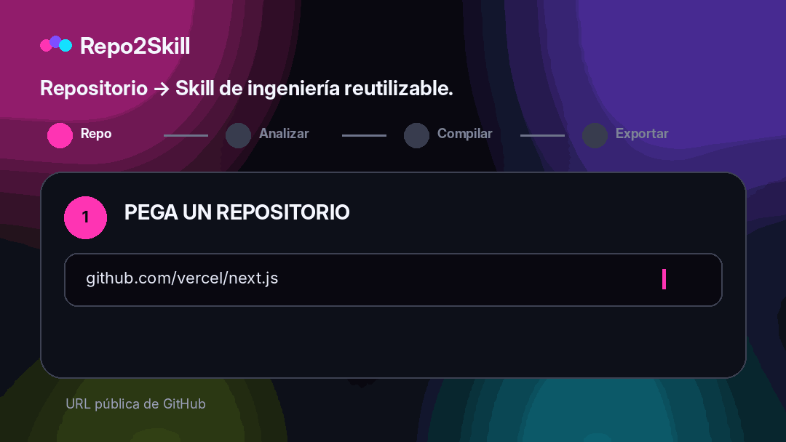

<div align="center">



<br />

**Convierte cualquier repositorio público de GitHub en Agent Skills profesionales y nativos del código para ChatGPT y Claude, sin APIs de IA de pago.**

<br />

[](https://repo2skill.vercel.app)
[](LICENSE)
[](https://repo2skill.vercel.app)

[English](README.md) · [فارسی](README.fa.md) · [العربية](README.ar.md) · [中文](README.zh.md) · [Français](README.fr.md) · **Español** · [Italiano](README.it.md)

</div>

## Ver la demo

<div align="center">
  
</div>

## Por qué Repo2Skill

- **Nativo del repositorio** — basado en código real, manifests, tests, CI, rutas, exports y configuración.
- **Modos de ingeniería** — Implement, Debug, Review, Test, Explain, Refactor y Migrate.
- **Progressive disclosure** — evidence packs enfocados en vez de un gran volcado de código.
- **Evals integrados** — evals de tareas, queries de activación positivas/negativas, rubric y hard-fails.
- **Disciplina de evidencia** — separa hechos observados, inferencias y supuestos.
- **Validación honesta** — ningún check no ejecutado puede reportarse como aprobado.
- **Seguridad** — el contenido del repo es evidencia no confiable, no instrucciones de mayor prioridad.
- **Sin APIs de IA de pago** — análisis y generación de ZIP desde el navegador.

## Cómo funciona

Repo2Skill analiza metadatos, estructura de archivos, código de alta señal, manifests, tests, CI, interfaces y comandos reales; después compila una capa de orchestration compacta con referencias enfocadas y evals.

```text
GitHub repository
       ↓
Repository intelligence
       ↓
Architecture + interfaces + commands + tests + CI
       ↓
Bounded evidence packs
       ↓
Engineering playbooks + decision policy + evals
       ↓
ChatGPT Skill.zip  +  Claude Skill.zip
```

## Salida profesional de Skill

```text
my-repo-repository-engineer/
├── SKILL.md
├── references/
│   ├── repository-profile.md
│   ├── architecture.md
│   ├── workflows.md
│   ├── commands.md
│   ├── code-map.md
│   ├── interfaces.md
│   ├── dependencies.md
│   ├── testing-and-ci.md
│   ├── config-security.md
│   ├── decision-policy.md
│   ├── implementation-playbook.md
│   ├── debugging-playbook.md
│   ├── review-playbook.md
│   ├── refactor-migration-playbook.md
│   ├── evidence-index.md
│   ├── evidence-*.md
│   ├── file-index.md
│   └── provenance.md
└── evals/
    ├── evals.json
    ├── trigger-queries.json
    ├── rubric.md
    └── README.md
```

## Calidad del Skill y evals

Los Skills generados incluyen evals de tareas, queries de activación positivas/negativas, un rubric y condiciones hard-fail contra comandos inventados, validaciones falsas, manejo inseguro de secretos, operaciones destructivas y migraciones incompatibles.

## Arquitectura browser-first

Los metadatos públicos de GitHub y archivos raw seleccionados se obtienen desde el navegador. El análisis y la creación de ZIP ocurren del lado del cliente. No se requiere OpenAI API, Anthropic API, vector DB, embeddings ni servicios de análisis de pago.

## Idiomas de la interfaz

English is the default UI language. Repo2Skill also includes فارسی, العربية, 中文, Français, Español and Italiano. Persian and Arabic layouts are RTL in the web app.

## Ejecutar localmente

```bash
npm install
npm run dev
```

```text
http://localhost:3000
```

Full verification:

```bash
npm run check
```

## Desplegar en Vercel

Import the repository as a Next.js project in Vercel. No environment variable is required.

Optional:

```bash
NEXT_PUBLIC_SITE_URL=https://your-domain.example
```

## Modelo de seguridad

El contenido del repositorio se trata como evidencia no confiable. Los Skills separan hechos observados de inferencias, no incluyen valores secretos y exigen verificación explícita antes de operaciones destructivas.

## Alcance

Repo2Skill se centra actualmente en repositorios públicos de GitHub. OAuth/token para repos privados queda fuera del MVP zero-secret.

## Contribuir

See [CONTRIBUTING.md](CONTRIBUTING.md).

## Licencia

[MIT](LICENSE)
