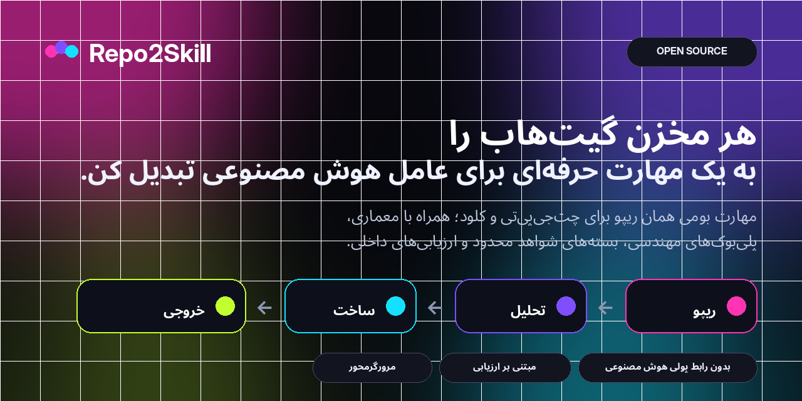
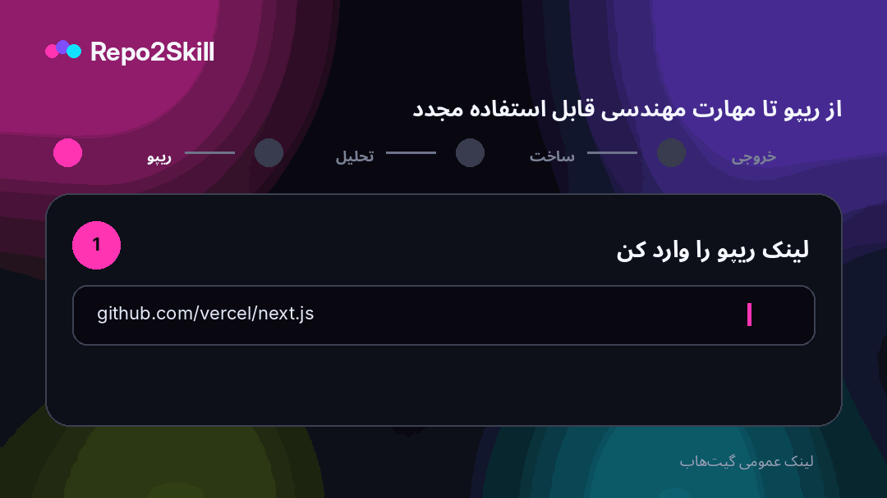

<div align="center">



<br />

**هر مخزن عمومی GitHub را بدون API پولی هوش مصنوعی به دو Agent Skill حرفه‌ای و بومیِ همان کدبیس برای ChatGPT و Claude تبدیل کن.**

<br />

[](https://repo2skill.vercel.app)
[](LICENSE)
[](https://repo2skill.vercel.app)

[English](README.md) · **فارسی** · [العربية](README.ar.md) · [中文](README.zh.md) · [Français](README.fr.md) · [Español](README.es.md) · [Italiano](README.it.md)

</div>

## دموی محصول

<div align="center">
  
</div>

## چرا Repo2Skill؟

- **بومیِ همان ریپو** — بر اساس سورس واقعی، manifestها، تست‌ها، CI، routeها، exportها و config.
- **حالت‌های مهندسی** — Implement، Debug، Review، Test، Explain، Refactor و Migrate.
- **Progressive disclosure** — evidence packهای کوچک و هدفمند، نه یک dump بزرگ از سورس.
- **Eval داخلی** — task eval، trigger query مثبت/منفی، rubric و hard-fail.
- **انضباط شواهد** — واقعیت مشاهده‌شده، inference و assumption از هم جدا می‌مانند.
- **صداقت در validation** — هیچ check اجرا‌نشده‌ای نمی‌تواند به‌عنوان passed گزارش شود.
- **امنیت‌محور** — متن ریپو فقط evidence غیرقابل‌اعتماد است، نه instruction سطح بالاتر.
- **بدون API پولی هوش مصنوعی** — تحلیل ریپو و ساخت ZIP داخل مرورگر انجام می‌شود.

## چطور کار می‌کند؟

Repo2Skill متادیتا، ساختار فایل‌ها، فایل‌های پرسیگنال، manifestها، تست‌ها، CI، interfaceها و commandهای واقعی ریپو را تحلیل می‌کند؛ سپس یک لایه orchestration جمع‌وجور به‌همراه referenceهای متمرکز و evalها می‌سازد.

```text
GitHub repository
       ↓
Repository intelligence
       ↓
Architecture + interfaces + commands + tests + CI
       ↓
Bounded evidence packs
       ↓
Engineering playbooks + decision policy + evals
       ↓
ChatGPT Skill.zip  +  Claude Skill.zip
```

## خروجی حرفه‌ای Skill

```text
my-repo-repository-engineer/
├── SKILL.md
├── references/
│   ├── repository-profile.md
│   ├── architecture.md
│   ├── workflows.md
│   ├── commands.md
│   ├── code-map.md
│   ├── interfaces.md
│   ├── dependencies.md
│   ├── testing-and-ci.md
│   ├── config-security.md
│   ├── decision-policy.md
│   ├── implementation-playbook.md
│   ├── debugging-playbook.md
│   ├── review-playbook.md
│   ├── refactor-migration-playbook.md
│   ├── evidence-index.md
│   ├── evidence-*.md
│   ├── file-index.md
│   └── provenance.md
└── evals/
    ├── evals.json
    ├── trigger-queries.json
    ├── rubric.md
    └── README.md
```

## کیفیت Skill و Evalها

Skillهای تولیدشده شامل task eval، trigger queryهای مثبت/منفی، rubric ارزیابی و hard-fail برای command جعلی، ادعای validation دروغ، secret handling ناامن، عملیات مخرب و migrationهای breaking هستند.

## معماری Browser-first

متادیتای عمومی GitHub و فایل‌های raw منتخب از خود مرورگر دریافت می‌شوند. تحلیل و ساخت ZIP client-side است؛ OpenAI API، Anthropic API، vector DB، embedding یا سرویس تحلیل پولی لازم نیست.

## زبان‌های رابط کاربری

English is the default UI language. Repo2Skill also includes فارسی, العربية, 中文, Français, Español and Italiano. Persian and Arabic layouts are RTL in the web app.

## اجرای محلی

```bash
npm install
npm run dev
```

```text
http://localhost:3000
```

Full verification:

```bash
npm run check
```

## دیپلوی روی Vercel

Import the repository as a Next.js project in Vercel. No environment variable is required.

Optional:

```bash
NEXT_PUBLIC_SITE_URL=https://your-domain.example
```

## مدل امنیتی

محتوای repository به‌عنوان evidence غیرقابل‌اعتماد در نظر گرفته می‌شود. Skill واقعیت مشاهده‌شده را از inference جدا می‌کند، secret value ذخیره نمی‌کند و قبل از release/deploy/reset/migration مخرب نیاز به verification صریح دارد.

## محدوده فعلی

نسخه فعلی Repo2Skill روی repositoryهای عمومی GitHub تمرکز دارد. پشتیبانی OAuth/token برای repo خصوصی عمداً خارج از MVP بدون secret است.

## مشارکت

See [CONTRIBUTING.md](CONTRIBUTING.md).

## مجوز

[MIT](LICENSE)
