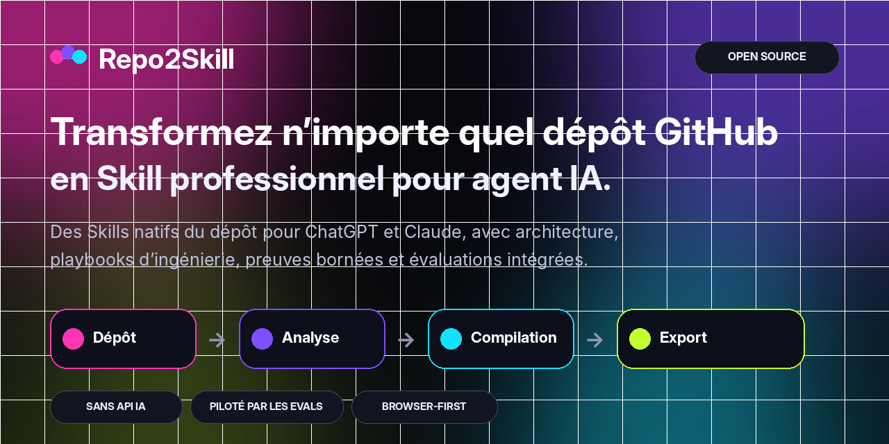
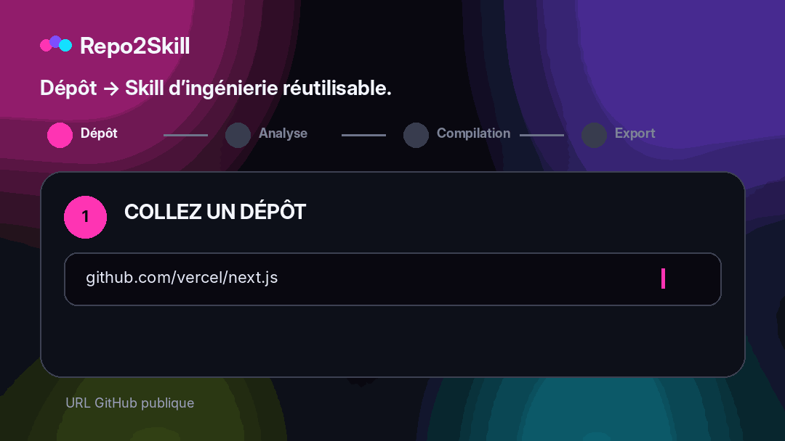

<div align="center">



<br />

**Transformez n’importe quel dépôt GitHub public en Agent Skills professionnels et natifs du code pour ChatGPT et Claude, sans API IA payante.**

<br />

[](https://repo2skill.vercel.app)
[](LICENSE)
[](https://repo2skill.vercel.app)

[English](README.md) · [فارسی](README.fa.md) · [العربية](README.ar.md) · [中文](README.zh.md) · **Français** · [Español](README.es.md) · [Italiano](README.it.md)

</div>

## Voir la démo

<div align="center">
  
</div>

## Pourquoi Repo2Skill

- **Natif du dépôt** — basé sur le vrai code, les manifests, tests, CI, routes, exports et configs.
- **Modes d’ingénierie** — Implement, Debug, Review, Test, Explain, Refactor et Migrate.
- **Progressive disclosure** — evidence packs ciblés plutôt qu’un énorme dump de sources.
- **Evals intégrés** — evals de tâches, requêtes d’activation positives/négatives, rubric et hard-fails.
- **Discipline de preuve** — faits observés, inférences et hypothèses restent distincts.
- **Validation honnête** — un check non exécuté ne peut jamais être annoncé comme réussi.
- **Sécurité** — le contenu du dépôt est une preuve non fiable, jamais une instruction prioritaire.
- **Zéro API IA payante** — analyse et génération des ZIP côté navigateur.

## Fonctionnement

Repo2Skill analyse les métadonnées, l’arborescence, les fichiers à fort signal, manifests, tests, CI, interfaces et commandes réelles du dépôt, puis compile une orchestration compacte avec des références ciblées et des evals.

```text
GitHub repository
       ↓
Repository intelligence
       ↓
Architecture + interfaces + commands + tests + CI
       ↓
Bounded evidence packs
       ↓
Engineering playbooks + decision policy + evals
       ↓
ChatGPT Skill.zip  +  Claude Skill.zip
```

## Sortie Skill professionnelle

```text
my-repo-repository-engineer/
├── SKILL.md
├── references/
│   ├── repository-profile.md
│   ├── architecture.md
│   ├── workflows.md
│   ├── commands.md
│   ├── code-map.md
│   ├── interfaces.md
│   ├── dependencies.md
│   ├── testing-and-ci.md
│   ├── config-security.md
│   ├── decision-policy.md
│   ├── implementation-playbook.md
│   ├── debugging-playbook.md
│   ├── review-playbook.md
│   ├── refactor-migration-playbook.md
│   ├── evidence-index.md
│   ├── evidence-*.md
│   ├── file-index.md
│   └── provenance.md
└── evals/
    ├── evals.json
    ├── trigger-queries.json
    ├── rubric.md
    └── README.md
```

## Qualité des Skills & evals

Les Skills générés incluent des evals de tâches, des requêtes d’activation positives/négatives, un rubric et des hard-fail conditions contre les commandes inventées, les validations fictives, la mauvaise gestion des secrets, les opérations destructrices et les migrations cassantes.

## Architecture browser-first

Les métadonnées GitHub publiques et les fichiers raw sélectionnés sont récupérés depuis le navigateur. L’analyse et la génération ZIP sont côté client. Aucune API OpenAI, Anthropic, base vectorielle, embedding ou analyse payante n’est requise.

## Langues de l’interface

English is the default UI language. Repo2Skill also includes فارسی, العربية, 中文, Français, Español and Italiano. Persian and Arabic layouts are RTL in the web app.

## Exécuter localement

```bash
npm install
npm run dev
```

```text
http://localhost:3000
```

Full verification:

```bash
npm run check
```

## Déployer sur Vercel

Import the repository as a Next.js project in Vercel. No environment variable is required.

Optional:

```bash
NEXT_PUBLIC_SITE_URL=https://your-domain.example
```

## Modèle de sécurité

Le contenu du dépôt est traité comme une preuve non fiable. Les Skills séparent faits observés et inférences, n’embarquent pas de valeurs secrètes et demandent une vérification explicite avant les opérations destructrices.

## Périmètre

Repo2Skill se concentre actuellement sur les dépôts GitHub publics. OAuth/token pour les dépôts privés reste volontairement hors du MVP zero-secret.

## Contribuer

See [CONTRIBUTING.md](CONTRIBUTING.md).

## Licence

[MIT](LICENSE)
