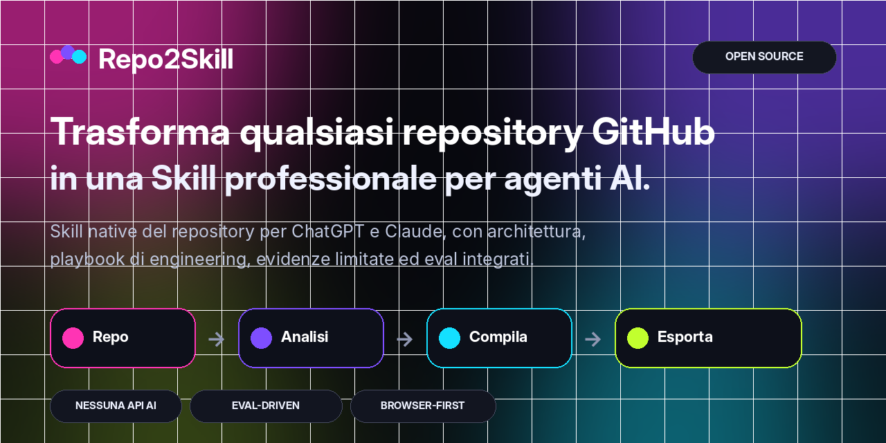
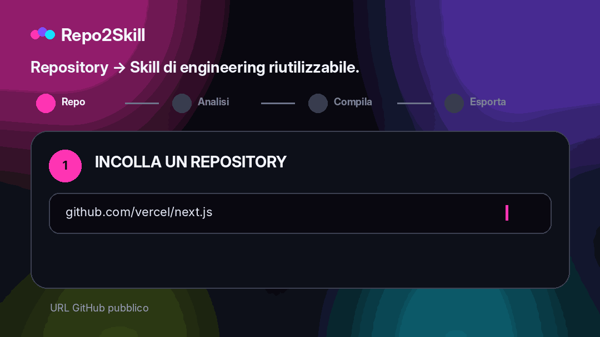

<div align="center">



<br />

**Trasforma qualsiasi repository GitHub pubblico in Agent Skills professionali e native del codebase per ChatGPT e Claude, senza API AI a pagamento.**

<br />

[](https://repo2skill.vercel.app)
[](LICENSE)
[](https://repo2skill.vercel.app)

[English](README.md) · [فارسی](README.fa.md) · [العربية](README.ar.md) · [中文](README.zh.md) · [Français](README.fr.md) · [Español](README.es.md) · **Italiano**

</div>

## Guarda la demo

<div align="center">
  
</div>

## Perché Repo2Skill

- **Nativa del repository** — basata su codice reale, manifest, test, CI, route, export e configurazione.
- **Modalità di engineering** — Implement, Debug, Review, Test, Explain, Refactor e Migrate.
- **Progressive disclosure** — evidence pack focalizzati invece di un enorme dump del sorgente.
- **Eval integrati** — task eval, query di attivazione positive/negative, rubric e hard-fail.
- **Disciplina delle evidenze** — fatti osservati, inferenze e assunzioni restano distinti.
- **Validazione onesta** — un check non eseguito non può mai essere dichiarato superato.
- **Sicurezza** — il contenuto del repo è evidenza non attendibile, non istruzioni di priorità superiore.
- **Zero API AI a pagamento** — analisi e ZIP vengono generati dal browser.

## Come funziona

Repo2Skill analizza metadata, struttura dei file, sorgenti ad alto segnale, manifest, test, CI, interfacce e comandi reali, quindi compila una orchestration compatta con riferimenti focalizzati ed eval.

```text
GitHub repository
       ↓
Repository intelligence
       ↓
Architecture + interfaces + commands + tests + CI
       ↓
Bounded evidence packs
       ↓
Engineering playbooks + decision policy + evals
       ↓
ChatGPT Skill.zip  +  Claude Skill.zip
```

## Output Skill professionale

```text
my-repo-repository-engineer/
├── SKILL.md
├── references/
│   ├── repository-profile.md
│   ├── architecture.md
│   ├── workflows.md
│   ├── commands.md
│   ├── code-map.md
│   ├── interfaces.md
│   ├── dependencies.md
│   ├── testing-and-ci.md
│   ├── config-security.md
│   ├── decision-policy.md
│   ├── implementation-playbook.md
│   ├── debugging-playbook.md
│   ├── review-playbook.md
│   ├── refactor-migration-playbook.md
│   ├── evidence-index.md
│   ├── evidence-*.md
│   ├── file-index.md
│   └── provenance.md
└── evals/
    ├── evals.json
    ├── trigger-queries.json
    ├── rubric.md
    └── README.md
```

## Qualità Skill ed eval

Le Skill generate includono task eval, query di attivazione positive/negative, rubric e condizioni hard-fail contro comandi inventati, validazioni false, gestione insicura dei segreti, operazioni distruttive e migrazioni breaking.

## Architettura browser-first

I metadata pubblici GitHub e i file raw selezionati vengono recuperati dal browser. Analisi e generazione ZIP sono client-side. Non servono OpenAI API, Anthropic API, vector DB, embedding o servizi di analisi a pagamento.

## Lingue dell’interfaccia

English is the default UI language. Repo2Skill also includes فارسی, العربية, 中文, Français, Español and Italiano. Persian and Arabic layouts are RTL in the web app.

## Esecuzione locale

```bash
npm install
npm run dev
```

```text
http://localhost:3000
```

Full verification:

```bash
npm run check
```

## Deploy su Vercel

Import the repository as a Next.js project in Vercel. No environment variable is required.

Optional:

```bash
NEXT_PUBLIC_SITE_URL=https://your-domain.example
```

## Modello di sicurezza

Il contenuto del repository è trattato come evidenza non affidabile. Le Skill separano fatti osservati e inferenze, non includono valori segreti e richiedono verifica esplicita prima di operazioni distruttive.

## Ambito

Repo2Skill si concentra attualmente sui repository GitHub pubblici. Il supporto OAuth/token per repository privati è volutamente fuori dal MVP zero-secret.

## Contribuire

See [CONTRIBUTING.md](CONTRIBUTING.md).

## Licenza

[MIT](LICENSE)
