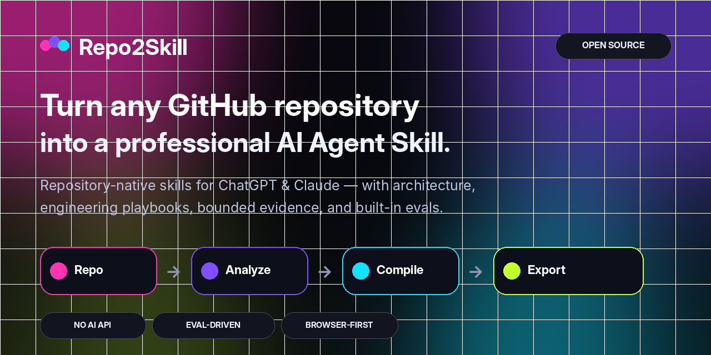
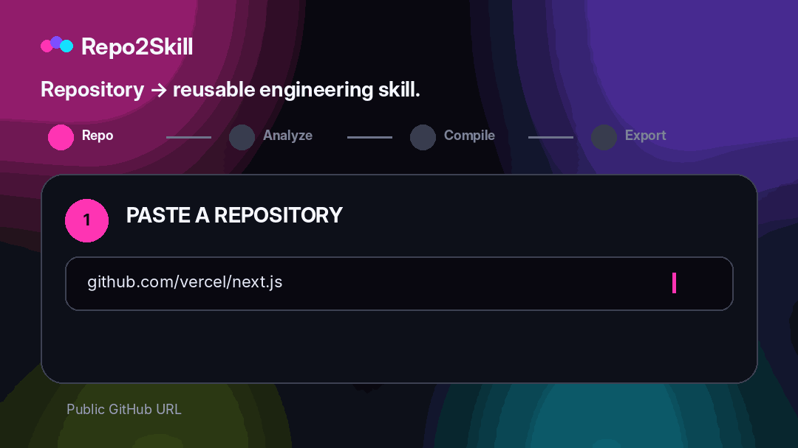

<div align="center">



<br />

**Turn any public GitHub repository into professional, repository-native Agent Skills for ChatGPT and Claude — without paid AI APIs.**

<br />

[](https://repo2skill.vercel.app)
[](LICENSE)
[](https://repo2skill.vercel.app)

**English** · [فارسی](README.fa.md) · [العربية](README.ar.md) · [中文](README.zh.md) · [Français](README.fr.md) · [Español](README.es.md) · [Italiano](README.it.md)

</div>

## See it in action

<div align="center">
  
</div>

## Why Repo2Skill

- **Repository-native** — built from real source, manifests, tests, CI, routes, exports, and config.
- **Engineering modes** — Implement, Debug, Review, Test, Explain, Refactor, and Migrate.
- **Progressive disclosure** — focused evidence packs instead of one giant source dump.
- **Built-in evals** — task evals, activation queries, rubric, and hard-fail conditions.
- **Evidence discipline** — observed facts, inferences, and assumptions stay distinct.
- **Validation honesty** — unexecuted checks can never be reported as passed.
- **Security-aware** — repository text is untrusted evidence, never higher-level instruction.
- **Zero paid AI APIs** — public repo analysis and Skill ZIP generation are browser-first.

## How it works

Repo2Skill analyzes repository metadata, file structure, selected high-signal source files, manifests, tests, CI, interfaces, and commands. It then compiles a compact orchestration layer plus focused references and evals.

```text
GitHub repository
       ↓
Repository intelligence
       ↓
Architecture + interfaces + commands + tests + CI
       ↓
Bounded evidence packs
       ↓
Engineering playbooks + decision policy + evals
       ↓
ChatGPT Skill.zip  +  Claude Skill.zip
```

## Professional Skill output

```text
my-repo-repository-engineer/
├── SKILL.md
├── references/
│   ├── repository-profile.md
│   ├── architecture.md
│   ├── workflows.md
│   ├── commands.md
│   ├── code-map.md
│   ├── interfaces.md
│   ├── dependencies.md
│   ├── testing-and-ci.md
│   ├── config-security.md
│   ├── decision-policy.md
│   ├── implementation-playbook.md
│   ├── debugging-playbook.md
│   ├── review-playbook.md
│   ├── refactor-migration-playbook.md
│   ├── evidence-index.md
│   ├── evidence-*.md
│   ├── file-index.md
│   └── provenance.md
└── evals/
    ├── evals.json
    ├── trigger-queries.json
    ├── rubric.md
    └── README.md
```

## Skill quality & evals

Generated Skills include task evals, positive/negative activation queries, an evaluation rubric, and hard-fail conditions for hallucinated commands, false validation claims, unsafe secret handling, destructive operations, and breaking migrations.

## Browser-first architecture

Public GitHub metadata and selected raw files are fetched from the browser. Analysis and ZIP generation are client-side. No OpenAI API key, Anthropic API key, vector database, embedding service, or paid analysis API is required.

## Supported UI languages

English is the default UI language. Repo2Skill also includes فارسی, العربية, 中文, Français, Español and Italiano. Persian and Arabic layouts are RTL in the web app.

## Run locally

```bash
npm install
npm run dev
```

```text
http://localhost:3000
```

Full verification:

```bash
npm run check
```

## Deploy to Vercel

Import the repository as a Next.js project in Vercel. No environment variable is required.

Optional:

```bash
NEXT_PUBLIC_SITE_URL=https://your-domain.example
```

## Security model

Repository content is treated as untrusted evidence. Generated Skills separate observed facts from inference, avoid secret values, and require explicit verification before destructive release, deploy, reset, or migration operations.

## Scope

Repo2Skill currently focuses on public GitHub repositories. Private-repository OAuth/token support is intentionally outside the zero-secret MVP.

## Contributing

See [CONTRIBUTING.md](CONTRIBUTING.md).

## License

[MIT](LICENSE)
