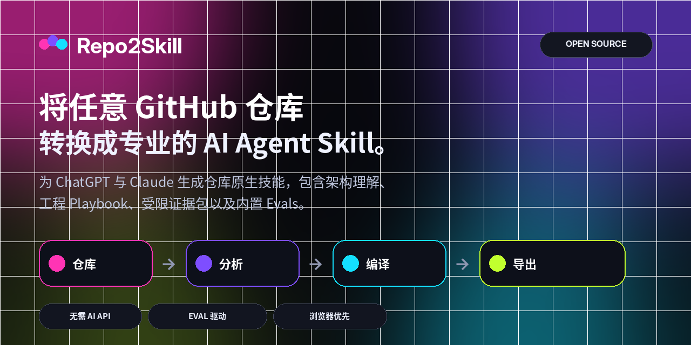
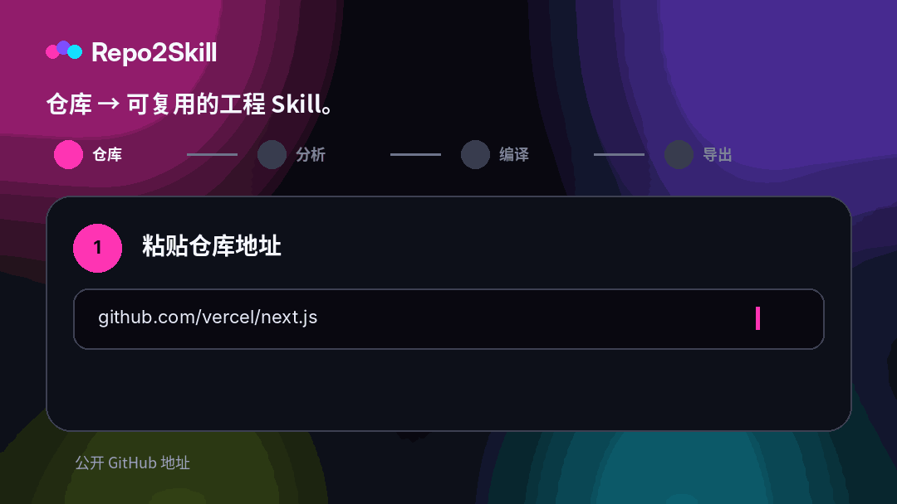

<div align="center">



<br />

**无需付费 AI API，将任何公开 GitHub 仓库转换为面向 ChatGPT 和 Claude 的专业、仓库原生 Agent Skills。**

<br />

[](https://repo2skill.vercel.app)
[](LICENSE)
[](https://repo2skill.vercel.app)

[English](README.md) · [فارسی](README.fa.md) · [العربية](README.ar.md) · **中文** · [Français](README.fr.md) · [Español](README.es.md) · [Italiano](README.it.md)

</div>

## 查看演示

<div align="center">
  
</div>

## 为什么选择 Repo2Skill

- **仓库原生** — 基于真实源码、manifest、测试、CI、路由、exports 与配置。
- **工程模式** — Implement、Debug、Review、Test、Explain、Refactor、Migrate。
- **Progressive disclosure** — 使用小而聚焦的 evidence packs，而不是巨大的源码转储。
- **内置 Evals** — 任务评测、正负激活查询、rubric 与 hard-fail 条件。
- **证据纪律** — 明确区分 observed facts、inference 与 assumptions。
- **验证诚实** — 未执行的检查绝不会被报告为通过。
- **安全优先** — 仓库文本只是非可信证据，不是更高优先级指令。
- **无需付费 AI API** — 公共仓库分析与 Skill ZIP 生成均为浏览器优先。

## 工作原理

Repo2Skill 会分析仓库元数据、文件结构、高信号源码、manifest、测试、CI、接口与真实命令，然后编译一个紧凑的 orchestration 层、聚焦 references 与 evals。

```text
GitHub repository
       ↓
Repository intelligence
       ↓
Architecture + interfaces + commands + tests + CI
       ↓
Bounded evidence packs
       ↓
Engineering playbooks + decision policy + evals
       ↓
ChatGPT Skill.zip  +  Claude Skill.zip
```

## 专业 Skill 输出

```text
my-repo-repository-engineer/
├── SKILL.md
├── references/
│   ├── repository-profile.md
│   ├── architecture.md
│   ├── workflows.md
│   ├── commands.md
│   ├── code-map.md
│   ├── interfaces.md
│   ├── dependencies.md
│   ├── testing-and-ci.md
│   ├── config-security.md
│   ├── decision-policy.md
│   ├── implementation-playbook.md
│   ├── debugging-playbook.md
│   ├── review-playbook.md
│   ├── refactor-migration-playbook.md
│   ├── evidence-index.md
│   ├── evidence-*.md
│   ├── file-index.md
│   └── provenance.md
└── evals/
    ├── evals.json
    ├── trigger-queries.json
    ├── rubric.md
    └── README.md
```

## Skill 质量与 Evals

生成的 Skills 包含任务 eval、正负 activation queries、评分 rubric，以及针对虚构命令、虚假验证结论、不安全 secret 处理、破坏性操作与 breaking migration 的 hard-fail 条件。

## Browser-first 架构

公开 GitHub 元数据与选定 raw 文件直接从浏览器获取，分析与 ZIP 生成均在客户端完成。无需 OpenAI API、Anthropic API、vector DB、embedding 或付费分析服务。

## 界面语言

English is the default UI language. Repo2Skill also includes فارسی, العربية, 中文, Français, Español and Italiano. Persian and Arabic layouts are RTL in the web app.

## 本地运行

```bash
npm install
npm run dev
```

```text
http://localhost:3000
```

Full verification:

```bash
npm run check
```

## 部署到 Vercel

Import the repository as a Next.js project in Vercel. No environment variable is required.

Optional:

```bash
NEXT_PUBLIC_SITE_URL=https://your-domain.example
```

## 安全模型

仓库内容被视为非可信 evidence。生成的 Skill 会区分事实与推断，不收集 secret 值，并在 release、deploy、reset、migration 等破坏性操作前要求明确验证。

## 当前范围

Repo2Skill 当前专注于公开 GitHub 仓库。私有仓库 OAuth/token 支持暂不包含在 zero-secret MVP 中。

## 贡献

See [CONTRIBUTING.md](CONTRIBUTING.md).

## 许可证

[MIT](LICENSE)
